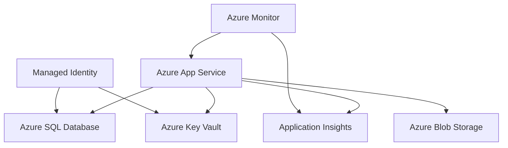

# Architecture Decision Record 002: Azure Services Selection

**Date:** October 3, 2025  
**Status:** Approved  
**Architects:** Riley  
**Context:** Azure PaaS Services Selection for eShopLegacyMVC  

## Context

Based on the analysis of the eShopLegacyMVC application and the requirement for rapid prototyping, we need to select specific Azure PaaS services that provide the best balance of functionality, ease of migration, and operational benefits.

## Decision

### 1. Compute Service: Azure App Service for Containers
**Selected Service:** Azure App Service (Windows Container)
**Rationale:**
- Native support for .NET Framework 4.7.2
- Built-in CI/CD integration capabilities
- Auto-scaling and load balancing
- Integrated monitoring with Application Insights
- SSL termination and custom domain support

**Alternative Considered:** Azure Container Apps
**Why Not Selected:** More complex for initial prototype; App Service provides simpler deployment model

### 2. Database Service: Azure SQL Database
**Selected Service:** Azure SQL Database (Single Database - S2 Standard tier for prototype)
**Rationale:**
- Direct compatibility with Entity Framework 6
- Built-in high availability and point-in-time restore
- Automated backups and patching
- Performance monitoring and query optimization recommendations

**Migration Strategy:** 
- Export LocalDB schema and data
- Update connection string to use Azure SQL Database
- Implement connection resilience patterns

### 3. Configuration Management: Azure Key Vault
**Selected Service:** Azure Key Vault (Standard tier)
**Rationale:**
- Centralized secrets management
- Integration with Azure App Service via Managed Identity
- Audit logging for compliance
- Cost-effective for prototype requirements

**Configuration Items to Store:**
- Database connection strings
- Application Insights instrumentation key
- Third-party API keys (if any)

### 4. Monitoring & Observability: Application Insights
**Selected Service:** Application Insights (already configured)
**Enhancements:**
- Custom telemetry for business metrics
- Dependency tracking for database calls
- Performance counters and health checks
- Structured logging integration

### 5. Storage Service: Azure Blob Storage (Future Enhancement)
**Selected Service:** Azure Blob Storage (Hot tier)
**Purpose:** Store product images instead of file system
**Rationale:**
- Scalable and cost-effective
- CDN integration capabilities
- Eliminates file system dependencies in containers

## Service Dependencies & Integration

## Cost Considerations (Prototype Tier)
- **Azure App Service:** S1 Standard (~$73/month)
- **Azure SQL Database:** S2 Standard (~$75/month)  
- **Azure Key Vault:** Standard (~$0.03 per 10K operations)
- **Application Insights:** First 5GB free, then ~$2.30/GB
- **Total Estimated Monthly Cost:** ~$150/month for prototype

## Security Configuration
- **Network Security:** Virtual Network integration for App Service
- **Identity:** Managed Identity for all service-to-service authentication
- **Encryption:** TLS 1.2+ for all communications, encryption at rest for all data
- **Access Control:** RBAC for Azure resources, service-specific access policies

## Backup & Disaster Recovery
- **Application:** Source code in Git repository, container images in registry
- **Database:** Automated backups with 7-day retention (configurable up to 35 days)
- **Configuration:** Key Vault automatically replicated within region
- **Recovery Objective:** RTO < 30 minutes, RPO < 15 minutes

## Consequences

### Positive
- Comprehensive PaaS solution with minimal operational overhead
- Built-in security, monitoring, and backup capabilities
- Clear upgrade path for future modernization
- Cost-effective for prototype and can scale to production

### Negative
- Vendor lock-in to Azure ecosystem
- Learning curve for operations team
- Ongoing costs vs. on-premises hosting